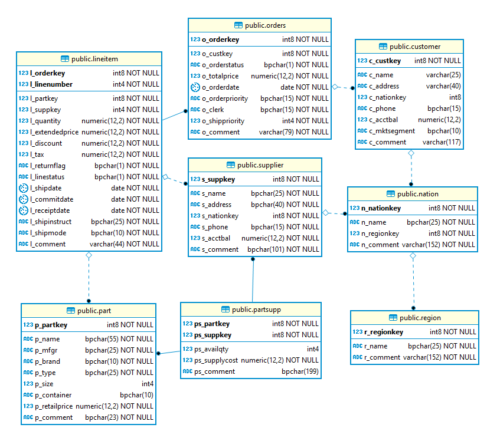

# Redshift Challenge

Inspired by the Redshift [table design](https://docs.aws.amazon.com/redshift/latest/dg/tutorial-tuning-tables.html)
and [table loading](https://docs.aws.amazon.com/redshift/latest/dg/c_best-practices-loading-take-loading-data-tutorial.html)
tutorials, using data and sample queries from the 
[TCP-H](http://www.tpc.org/tpch/) decision support benchmark, built using the 
[tpch-kit](https://github.com/gregrahn/tpch-kit) from 
[Greg Rahn](https://github.com/gregrahn).

## Prerequisites

[Download the latest version of DBeaver](https://dbeaver.io/download/) or get a copy from 
[shopit.nwie.net](http://shopit.nwie.net/Shopping/requestItem/detail?id=2107&query=dbeaver). **Note:**
If you don't have admin privileges on your laptop, choose the option to install just for you (not all users).

## References

* [Amazon Redshift Best Practices](https://docs.aws.amazon.com/redshift/latest/dg/best-practices.html)
* [Amazon Redshift Engineering’s Advanced Table Design Playbook](https://aws.amazon.com/blogs/big-data/amazon-redshift-engineerings-advanced-table-design-playbook-preamble-prerequisites-and-prioritization/)
* [Top 10 Performance Tuning Techniques for Amazon Redshift](https://aws.amazon.com/blogs/big-data/top-10-performance-tuning-techniques-for-amazon-redshift/)

## The Challenge
Over the summer, your department intern, Johnny, setup a Redshift cluster for the Marketing department. 
Initially, everything was performing well but as more data was added, performance started to degrade. Now, the AVP of 
Marketing is concerned because query performance is slow, the table load times are longer than anticipated, and storage 
usage is much higher than projected for the amount of data being stored.  

There is a bit of wiggle room in the budget to add more resources but, before doing so, your manager has
asked you to review Johnny's work and make sure it follows the 
[AWS Redshift best practices](https://docs.aws.amazon.com/redshift/latest/dg/best-practices.html). 
Having just earned your 
[AWS Big Data Speciality Certification](https://aws.amazon.com/certification/certified-big-data-specialty/) 
you are eager to impress her.

The marketing manager created a snapshot called ``inital-state-with-data`` for you to use in your evaluation. The admin
user is ``awsuser`` and the password is ``H0ppyIPA``. They
use a cluster of four (4) dc2.large nodes in production. The snapshot and most recent source data is in the Ohio 
region. The first thing you do is create a new cluster by restoring the snapshot.  

## Current Design

While waiting for the cluster to become available, you take a few minutes to review the Entity Relationship Diagram(ERD)
Liz, the data architect provided. 



Next, you compare the ERD above with the table create statements Johnny prepared shown below:
```sql
CREATE TABLE region
(
    R_REGIONKEY BIGINT ENCODE RAW,
    R_NAME CHAR(256) ENCODE RAW,
    R_COMMENT VARCHAR(256) ENCODE RAW
);

CREATE TABLE nation
(
    N_NATIONKEY BIGINT ENCODE RAW,
    N_NAME CHAR(256) ENCODE RAW,
    N_REGIONKEY BIGINT ENCODE RAW,
    N_COMMENT VARCHAR(256) ENCODE RAW
);

CREATE TABLE part
(
    P_PARTKEY BIGINT ENCODE RAW,
    P_NAME CHAR(256) ENCODE RAW,
    P_MFGR CHAR(256) ENCODE RAW,
    P_BRAND CHAR(256) ENCODE RAW,
    P_TYPE CHAR(256) ENCODE RAW,
    P_SIZE INTEGER ENCODE RAW,
    P_CONTAINER CHAR(256) ENCODE RAW,
    P_RETAILPRICE NUMERIC(12, 2) ENCODE RAW,
    P_COMMENT CHAR(256) ENCODE RAW
);

CREATE TABLE supplier
(
    S_SUPPKEY BIGINT ENCODE RAW,
    S_NAME CHAR(256) ENCODE RAW,
    S_ADDRESS CHAR(256) ENCODE RAW,
    S_NATIONKEY BIGINT ENCODE RAW,
    S_PHONE CHAR(256) ENCODE RAW,
    S_ACCTBAL NUMERIC(12, 2) ENCODE RAW,
    S_COMMENT CHAR(256) ENCODE RAW
);

CREATE TABLE customer
(
    C_CUSTKEY BIGINT ENCODE RAW,
    C_NAME VARCHAR(256) ENCODE RAW,
    C_ADDRESS VARCHAR(256) ENCODE RAW,
    C_NATIONKEY BIGINT ENCODE RAW,
    C_PHONE CHAR(256) ENCODE RAW,
    C_ACCTBAL NUMERIC(12, 2) ENCODE RAW,
    C_MKTSEGMENT CHAR(256) ENCODE RAW,
    C_COMMENT VARCHAR(256) ENCODE RAW
);

CREATE TABLE partsupp
(
    PS_PARTKEY BIGINT ENCODE RAW,
    PS_SUPPKEY BIGINT ENCODE RAW,
    PS_AVAILQTY INTEGER ENCODE RAW,
    PS_SUPPLYCOST NUMERIC(12, 2) ENCODE RAW,
    PS_COMMENT CHAR(256) ENCODE RAW
);

CREATE TABLE orders
(
    o_orderkey BIGINT DISTKEY ENCODE RAW,
    o_custkey BIGINT ENCODE RAW,
    o_orderstatus CHAR(256) ENCODE RAW,
    o_totalprice NUMERIC(12, 2) ENCODE RAW,
    o_orderdate CHAR(10) ENCODE RAW,
    o_orderpriority CHAR(256) ENCODE RAW,
    o_clerk CHAR(256) ENCODE RAW,
    o_shippriority INTEGER ENCODE RAW,
    o_comment VARCHAR(256) ENCODE RAW
);

CREATE TABLE lineitem
(
    l_orderkey BIGINT DISTKEY ENCODE RAW,
    l_partkey BIGINT ENCODE RAW,
    l_suppkey INTEGER ENCODE RAW,
    l_linenumber INTEGER ENCODE RAW,
    l_quantity NUMERIC(12, 2) ENCODE RAW,
    l_extendedprice NUMERIC(12, 2) ENCODE RAW,
    l_discount NUMERIC(12, 2) ENCODE RAW,
    l_tax NUMERIC(12, 2) ENCODE RAW,
    l_returnflag CHAR(256) ENCODE RAW,
    l_linestatus CHAR(256) ENCODE RAW,
    l_shipdate CHAR(10) ENCODE RAW,
    l_commitdate CHAR(10) ENCODE RAW,
    l_receiptdate CHAR(10) ENCODE RAW,
    l_shipinstruct CHAR(256) ENCODE RAW,
    l_shipmode CHAR(256) ENCODE RAW,
    l_comment VARCHAR(256) ENCODE RAW
);
```

Next, you look over the script Johnny created to load the data:
```sql
copy region FROM 's3://tpc-h-load-data/raw/region.tbl'
credentials 'aws_iam_role=arn:aws:iam::215087568033:role/myRedshiftRole' 
compupdate off delimiter '|' ;

copy nation FROM 's3://tpc-h-load-data/raw/nation.tbl'
credentials 'aws_iam_role=arn:aws:iam::215087568033:role/myRedshiftRole' 
compupdate off delimiter '|' ;

copy part FROM 's3://tpc-h-load-data/raw/part.tbl'
credentials 'aws_iam_role=arn:aws:iam::215087568033:role/myRedshiftRole' 
compupdate off delimiter '|' ;

copy supplier FROM 's3://tpc-h-load-data/raw/supplier.tbl'
credentials 'aws_iam_role=arn:aws:iam::215087568033:role/myRedshiftRole' 
compupdate off delimiter '|' ;

copy partsupp FROM 's3://tpc-h-load-data/raw/partsupp.tbl'
credentials 'aws_iam_role=arn:aws:iam::215087568033:role/myRedshiftRole' 
compupdate off delimiter '|' ;

copy customer FROM 's3://tpc-h-load-data/raw/customer.tbl'
credentials 'aws_iam_role=arn:aws:iam::215087568033:role/myRedshiftRole' 
compupdate off delimiter '|' ;

copy orders FROM 's3://tpc-h-load-data/raw/orders.tbl'
credentials 'aws_iam_role=arn:aws:iam::215087568033:role/myRedshiftRole' 
compupdate off delimiter '|' ;

copy lineitem FROM 's3://tpc-h-load-data/raw/lineitem.tbl'
credentials 'aws_iam_role=arn:aws:iam::215087568033:role/myRedshiftRole' 
compupdate off delimiter '|' ;
```
    
## Initial Analysis

### Benchmarks

Before making any changes, you want to understand the current state so you can report an accurate before and after 
picture. Record the following [statistics](TableStats.sql) before making any changes:

table            |load time (sec) |row count    |size (mb) |
-----------------|---------------:|------------:|---------:|
customer         |             32 |             |          |
lineitem         |          1,506 |             |          |
nation           |              5 |             |          |
orders           |            268 |             |          |
part             |             60 |             |          |
partsupp         |             72 |             |          |
region           |              5 |             |          |
supplier         |              7 |             |          |
**TOTALS**       |      **1,955** |             |          | 

### Sample Queries

In order to help you optimse the table design, Marketing has provided a few queries which are typically included in
their analysis.

#### Query 1

The Pricing Summary Report Query provides a summary pricing report for all lineitems shipped as of a given date. 
The date is within 60 - 120 days of the greatest ship date contained in the database. The query lists 
totals for extended price, discounted extended price, discounted extended price plus tax, average quantity, 
average extended price, and average discount. These aggregates are grouped by RETURNFLAG and LINESTATUS, and 
listed in ascending order of RETURNFLAG and LINESTATUS. A count of the number of lineitems in each 
group is included.

```sql
select l_returnflag,
       l_linestatus,
       sum(l_quantity) as sum_qty,
       sum(l_extendedprice) as sum_base_price,
       sum(l_extendedprice*(1-l_discount)) as sum_disc_price,
       sum(l_extendedprice*(1-l_discount)*(1+l_tax)) as sum_charge,
       avg(l_quantity) as avg_qty,
       avg(l_extendedprice) as avg_price,
       avg(l_discount) as avg_disc,
       count(*) as count_order
from lineitem
where l_shipdate <= date '1998-12-01' - interval '90' day
group by l_returnflag, l_linestatus
order by l_returnflag, l_linestatus;
```

#### Query 2

The Volume Shipping Query finds, for two given nations, the gross discounted revenues derived from lineitems in 
which parts were shipped from a supplier in either nation to a customer in the other nation during 1995 and 1996. 
The query lists the supplier nation, the customer nation, the year, and the revenue from shipments that took place
in that year. The query orders the answer by Supplier nation, Customer nation, and year (all ascending).

The business analyst gave them a slightly different query but it would not run due to date related errors. The marketing
manager would like you to git rid of the work arounds.

```sql
select supp_nation, cust_nation, l_year, sum(volume) as revenue
from (
      select
             n1.n_name as supp_nation,
             n2.n_name as cust_nation,
             -- WORKS:
             SUBSTRING(l_shipdate,1,4) as l_year,
             -- SHOULD BE:
             -- extract(year from l_shipdate) as l_year,
             l_extendedprice * (1-l_discount) as volume
      from supplier, lineitem, orders, customer, nation n1, nation n2
      where s_suppkey = l_suppkey
        and o_orderkey = l_orderkey
        and c_custkey = o_custkey
        and s_nationkey = n1.n_nationkey
        and c_nationkey = n2.n_nationkey
        and (
              (n1.n_name = 'CANADA' and n2.n_name = 'UNITED STATES')
                or (n1.n_name = 'UNITED STATES' and n2.n_name = 'CANADA')
            )
        -- WORKS:
        and l_shipdate between '1995-01-01' and '1996-12-31') as shipping
        -- SHOULD BE:
        -- and l_shipdate between date '1995-01-01' and date '1996-12-31') as shipping 
group by supp_nation, cust_nation, l_year
order by supp_nation, cust_nation, l_year;
```

#### Query 3

The Returned Item Reporting Query finds the top 20 customers, in terms of their effect on lost revenue for a given 
quarter, who have returned parts. The query considers only parts that were ordered in the specified quarter. The 
query lists the customer's name, address, nation, phone number, account balance, comment information and revenue 
lost. The customers are listed in descending order of lost revenue. Revenue lost is defined as 
sum(l_extendedprice*(1-l_discount)) for all qualifying lineitems.
```sql
select c_custkey, c_name, sum(l_extendedprice * (1 - l_discount)) as revenue, c_acctbal, n_name, c_address, c_phone, c_comment
from customer, orders, lineitem, nation
where c_custkey = o_custkey
  and l_orderkey = o_orderkey
  and o_orderdate >= date '1993-10-01'
  and o_orderdate < date '1993-10-01' + interval '3' month
  and l_returnflag = 'R'
  and c_nationkey = n_nationkey
group by c_custkey, c_name, c_acctbal, c_phone, n_name, c_address, c_comment
order by revenue desc
limit 20;
```

1. Record the execution time of each query, ignoring the first result which includes query compile time, 
making sure to disable caching

    | Query   | Execution time (sec) |
    |---------|---------------------:|
    | Query 1 | 
    | Query 2 | 
    | Query 3 | 
    | **TOTAL** | 

1. Record the execution plan for each query

### Best Practices Analysis

1. Which [table design best practices](https://docs.aws.amazon.com/redshift/latest/dg/c_designing-tables-best-practices.html) 
did Johnny follow?

1. Which did he miss?

1. Which [table loading best practices](https://docs.aws.amazon.com/redshift/latest/dg/c_loading-data-best-practices.html) 
did Johnny follow?

1. Which did he miss?

## Apply Table Design Best Practices

1. Given the ERD and sample queries above, update Johnny's table definitions to account for all table design best 
practices

    <details>
     <summary>Hint</summary>
     <ul><li>Every field on the ERD except for the comments has <code>NOT NULL</code>. How does Redshit treat the NOT NULL constraint?</li></ul>
    </details>
    
    <details>
     <summary>Hint</summary>
     <ul><li>The ERD shows one or more primary keys for each table. How does Redshit treat primary keys?</li></ul>
    </details>
    
    <details>
     <summary>Hint</summary>
     <ul><li>The ERD shows how tables relate to each other based on foreign keys. How does Redshit treat foreign keys?</li></ul>
    </details>
    
    <details>
     <summary>Hint</summary>
     <ul><li>Every column in the DDL has, <code>ENCODE RAW</code>. What does this do?</li></ul>
    </details>
    
    <details>
     <summary>Hint</summary>
     <ul><li>Do the character field sizes and date field types match the ERD?  If not, what are the potential impacts?</li></ul>
    </details>
    
    <details>
     <summary>Hint</summary>
     <ul><li>When creating the DDL, did Johnny account for all items in the hints above?</li></ul>
    </details>

    ```sql
    


 

    ```

1.  Cite best practices and provide data to support your choices for sort keys and distribution styles assuming 
marketing wants to balance storage and load times with good query performance. 

1.  If fast query performance was more important than slower load times and greater storage usage, what changes would
you make?


## Apply Table Loading Best Practices

1. Update the table loading script to follow the table loading best practices. 

    <details>
     <summary>Hint</summary>
     <ul><li>The copy jobs include the statement <code>compupdate off</code>. What does this do?</li></ul>
    </details>

    <details>
     <summary>Hint</summary>
     <ul><li>Does the S3 data source bucket have information about the source files that relate to the best processes?</li></ul>
    </details>

    <details>
     <summary>Hint</summary>
     <ul><li>What is the value of the <code>.manifest</code> files?</li></ul>
    </details>

    ```sql


    ```

1. Since each DC2.large compute node [has 2 slices](https://docs.aws.amazon.com/redshift/latest/mgmt/working-with-clusters.html#rs-dense-compute-nodes-table), 
what ETL change can you recommend to further reduce load times?

    <details>
     <summary>Hint</summary>
     <ul><li>COPY can concurrently process one file per slice on each node.</li></ul>
    </details>

    
## Test Your Changes

1. [Drop](DropTables.sql) the existing tables

1. Run your new create table scripts

1. Refresh the table data using your new copy commands
 
1. Update the table statistics:
    
    table            |load time (sec) |row count    |size (mb) |
    -----------------|---------------:|------------:|---------:|
    customer         |                |             |          |
    lineitem         |                |             |          |
    nation           |                |             |          |
    orders           |                |             |          |
    part             |                |             |          |
    partsupp         |                |             |          |
    region           |                |             |          |
    supplier         |                |             |          |
    **TOTALS**       |                |             |          |

1. Record the execution time of each query

    | Query   | Original time (sec) | New Time
    |---------|--------------------:|---------:|
    | Query 1 |                     | 
    | Query 2 |                     | 
    | Query 3 |                     | 
    | **TOTAL** |                   | 

1. Record the execution plan for each query and identify the improvements

## Summary

Thanks to your hard work, your boss should not have to add resources to the cluster and Marketing should be happy with
the improvements you made to their data warehouse. Summarize your work below:

1.  What best practices did you apply?

1.  How much did you reduce storage consumption?

1.  How much did you improve query performance?

1.  How much did you speed up table load time?

## Bonus Work

1. Based on the orders table, can additional space be saved using different column encodings?

1. If so, what would the table definition look like for the orders table?

1. Is this a best practice?  Why or why not?


